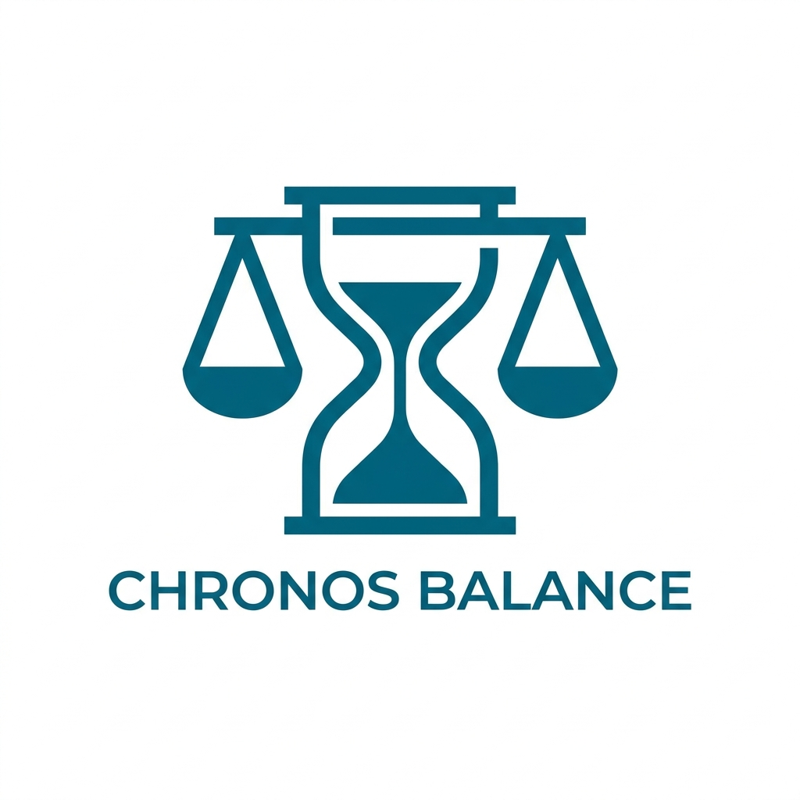

<div align="center">



# CHRONOS BALANCE

**Architectural Time Management**

*Time is not just measured — it is orchestrated.*

[](https://expo.dev)
[](https://expo.dev)
[](https://www.typescriptlang.org)
[](https://github.com/Charelas/chronos-app)

</div>

---

## 🎯 The Problem

Modern knowledge workers face a silent crisis: **they track tasks, but not time quality**.

Existing time trackers (Toggl, Clockify) are built for billing or compliance — they record hours without asking *whether those hours are balanced*. The result:

- Professionals routinely over-invest in reactive work (meetings, email) at the cost of deep work
- Work-life imbalance goes unnoticed until burnout
- There is no tool that treats time as a *resource to be balanced*, not just counted

**Who this helps:** Indonesian remote workers, freelancers, and knowledge professionals who manage their own schedules and need a calm, intelligent way to maintain equilibrium.

---

## 💡 The Solution: The Balanced Chronograph

Chronos Balance introduces a new philosophy — **time as balance, not ledger**.

Instead of just logging hours, every session is categorized as either *positive* (Work, Overtime, Meeting) or *negative* (Personal, Education) and contributes to a **real-time time balance score**. Like a financial statement for your day.

```
Balance = Σ (Work + Meeting + Overtime) − Σ (Personal + Education)
```

When your balance is positive, you've built a surplus. When it's negative, you're overdue for focused work — or you've earned a break. The app tells you which, and why.

---

## ✨ Key Features

| Feature | Description |
|---|---|
| ⏱️ **Live Timer** | One-tap focus sessions with task naming & category |
| 📊 **Balance Dashboard** | Animated hero counter showing real-time time credit |
| 🤖 **AI Balance Insights** | Gemini 2.0 Flash analyses your week and generates personalised productivity coaching |
| 📈 **Analytics Report** | Weekly trend, category distribution, prev-week comparison |
| 🏢 **Project Details** | Dynamic project view driven by your actual logged data |
| 🔔 **Smart Notifications** | Context-aware alerts: idle reminders, streak milestones, goal checkpoints |
| ⚙️ **Temporal Targets** | Set weekly commitment & monthly cap — recalibrate anytime |
| 🎭 **Onboarding Flow** | 3-step personal setup: philosophy → name → weekly target |
| 💾 **Offline-First** | All data stored locally via AsyncStorage — no account needed |

---

## 🤖 AI Integration

Chronos Balance uses **Google Gemini 2.0 Flash** to analyse your weekly productivity data and generate a personalised balance insight on the Analytics screen.

The AI receives:
- Weekly hours logged vs. target
- Current balance score
- Peak productivity day
- Primary time category
- Week-over-week trend

It responds with a calm, actionable 1–2 sentence insight — styled to match the app's philosophy of *architectural calm, not aggressive productivity coaching*.

**Graceful fallback:** If no API key is set or the device is offline, a smart rule-based engine generates the insight locally — so the feature always works.

---

## 🎨 Design Philosophy: The Balanced Chronograph

> *"By prioritizing white space and breathing room, we ensure the user feels in control of their time — not chased by it."*

The design system is built on three principles:

**1. The No-Line Rule**
Structure is defined through background shifts and tonal nesting — never 1px solid borders.

**2. Editorial Authority**
Dual typeface system: **Manrope** (display, headlines) + **Inter** (body, labels). Balance totals use `display-lg` (72sp) to give them editorial weight.

**3. Tonal Depth**
Depth without shadows — achieved by stacking surface levels:
- Level 0: `surface` `#f7f9fb`
- Level 1: `surface-container-low` `#f2f4f6`
- Level 2: `surface-container-lowest` `#ffffff`

---

## 🛠️ Tech Stack

| Layer | Technology |
|---|---|
| Framework | Expo SDK 52 (React Native) |
| Language | TypeScript |
| Navigation | Expo Router (file-based) |
| State Management | React Context + `useMemo` + `useCallback` |
| Persistence | AsyncStorage (offline-first) |
| Styling | NativeWind + StyleSheet |
| AI | Google Gemini 2.0 Flash API |
| Icons | MaterialIcons (`@expo/vector-icons`) |
| Fonts | Manrope + Inter (Google Fonts via `expo-google-fonts`) |
| Animations | React Native Animated API (`Easing.out`, `Animated.loop`) |

---

## 🚀 Getting Started

### Prerequisites

- Node.js 18+
- Expo Go app on your device (or Android/iOS simulator)

### Installation

```bash
# Clone the repo
git clone https://github.com/Charelas/chronos-app.git
cd chronos-app

# Install dependencies
npm install

# (Optional) Add your Gemini API key for AI insights
# Create a .env file:
echo "EXPO_PUBLIC_GEMINI_API_KEY=your_key_here" > .env

# Start the development server
npx expo start
```

Scan the QR code with Expo Go, or press `a` for Android / `i` for iOS simulator.

### AI Setup (Optional)

1. Get a free API key at [Google AI Studio](https://aistudio.google.com/)
2. Add to `.env`: `EXPO_PUBLIC_GEMINI_API_KEY=AIza...`
3. The app falls back to rule-based insights automatically if the key is absent

---

## 📁 Project Structure

```
chronos-app/
├── app/
│   ├── (tabs)/
│   │   ├── index.tsx          # Dashboard — animated balance counter
│   │   ├── add.tsx            # Manual time entry
│   │   ├── history.tsx        # Full entry history
│   │   └── settings.tsx       # User settings & targets
│   ├── splash.tsx             # Animated splash screen
│   ├── welcome.tsx            # 3-step onboarding
│   ├── analytics.tsx          # AI insights + detailed charts
│   ├── project_details.tsx    # Dynamic project view
│   ├── team_balance.tsx       # Personal workspace overview
│   └── notifications.tsx      # Smart notification center
├── context/
│   └── AppContext.tsx         # Global state (entries, timer, settings)
├── utils/
│   ├── storage.ts             # AsyncStorage CRUD + balance logic
│   └── gemini.ts             # Gemini AI integration + rule-based fallback
└── constants/
    └── theme.ts               # Design system: Colors + Fonts
```

---

## 🏗️ Architecture Decisions

**Why AsyncStorage over SQLite?**
The app targets simplicity and zero-dependency setup. AsyncStorage is sufficient for the entry volume of a personal time tracker and ensures Expo Go compatibility without native modules.

**Why Context over Redux/Zustand?**
The state shape is small and co-located. `useMemo` on derived values (weeklyHours, totalBalance) prevents unnecessary re-renders without adding library overhead.

**Why rule-based AI fallback?**
Competition demos are unpredictable. The app must feel complete with or without network access. The rule-based engine covers all meaningful states (deficit, optimal, over-target, idle) and produces insight quality comparable to AI for common patterns.

---

## 📊 Competition: juaravibecoding 2026

This app was built for the **juaravibecoding** competition under the Triple-Threat Vibe criteria:

| Criterion | Weight | Implementation |
|---|---|---|
| **Problem** | 30% | Addresses real work-life imbalance; clear target audience; scalable concept |
| **Solution** | 40% | Fully functional mobile app; premium UX; measurable value (balance score) |
| **Uniqueness** | 30% | Editorial design philosophy; Gemini AI coaching; balance-as-currency concept |

---

## 📄 License

MIT © 2026 [Charelas](https://github.com/Charelas)

---

<div align="center">

**CHRONOS BALANCE · V. 1.0.0 · EST. 2026**

*Architecture / Precision / Balance*

</div>
